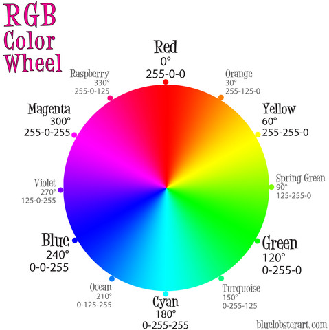

# Rainbows: Arrays and Hashes in combination
Let's practice when and where to use Arrays and Hashes, as well as how to interact with them when they are used in combination.

## Pre-learning: RGB Color Codes
In this exercise we are going to explore the use of Arrays and Hashes in a bit of detail. We will be talking about Rainbows and different color combinations. Before doing this, you should first [read up on the basics of RGB color codes](https://en.wikipedia.org/wiki/RGB_color_model)

## Variables and Data Types
We use variables to store information that we want to access and/or change later, but when creating those variables it is important that we choose the right data type for our information. Right now we only know a handful of data types, but in the future we are going to learn about many, many more different types of data. Each has its own use and we should consider that when picking which we use.

For example, if we wanted to store some different colors as their RGB color codes, we could do something like:

```ruby
red_hex = "#FF0000"
green_hex = "#00FF00"
blue_hex = "#0000FF"
```

Or maybe:

```ruby
red_rgb = "rgb(255,0,0)"
green_rgb = "rgb(0,255,0)"
blue_rgb = "rgb(0,0,255)"
```

**think** But what are the limitations of this?

We are showing the representations of the colors, but what if we wanted to make a color calculator? (_spoiler alert_: That's what we are going to do.) How could we access and/or change the values separately? We can do it, but it'd require some extra code that's not as readable as it could be.

For example, perhaps:

```ruby
red_val = red_hex[1..2]
```

This would isolate the "FF" in "#FF0000" but there's an easier way. Getting individual values out of the rgb codes would be even harder because you can't index the three values the same way you can with the hex values. (i.e. In Hex, the Red in RGB is always the first two characters after the #. In RBG, the Red is not always characters 4 through 6 like it is in red_rgb. For example, in green_rgb it's actually only character 4)

**think**: What would be a better data structure for storing values like this so that we can access each piece individually or the collection as a whole?

## Arrays
Did you read the title? Ok, yes, arrays would make this better.

```ruby
red = [255,0,0]
green = [0,255,0]
blue = [0,0,255]
```

If we do this, then we are easily able to isolate the pieces of `red` and manipulate them separately.

For example:

```ruby
puts "Red intensity of #{red} = #{red[0]}"
puts "Green intensity of #{red} = #{green[0]}"
puts "Blue intensity of #{red} = #{blue[0]}"
```

Interestingly (and also, mind-blowing weirdly to me), when you add RED + GREEN in the [RGB Color Model](https://en.wikipedia.org/wiki/RGB_color_model#Additive_primary_colors), you get YELLOW. Yeah, not a weird brown color. Yellow. (I just learned something about additive vs subtractive colors.)

```ruby
def mix_colors(color1,color2)
  mixed_color = []
  3.times do |i|
    mixed_color[i] = color1[i] + color2[i]
  end
  return mixed_color
end

puts mix_colors(red,green)
```

See, I didn't make it up. RED + GREEN = YELLOW


**think**: Ok, but what if we don't know that rgb(255,255,0) is yellow. What if we wanted to be able to look up what English color describes rgb(255,255,0). What type of structure could we use to make this easier?

## Hashes

I think you read the title again. Ok, let's use a hash, because a hash is a key/value pair that allows us to map a key to a value.

Perhaps we have something like:

```ruby
rainbow = {
  [255,0,0] => "red",
  [255,125,0] => "orange",
  [255,255,0] => "yellow",
  [125,255,0] => "spring green",
  [255,255,0] => "green",
  [0,255,125] => "turquoise",
  [0,255,255] => "cyan",
  [0,125,255] => "ocean",
  [0,0,255] => "blue",
  [125,0,255] => "violet",
  [255,0,255] => "magenta",
  [255,0,125] => "raspberry"
}
```



Then we could say:

```ruby
new_color = mix_colors(red,green)
puts "#{rainbow[red]} #{red} + #{rainbow[green]} #{green} = #{rainbow[new_color]} #{new_color}"
```

Success!

## Array of Hashes

Now we want to represent a rainbow of colors as an array of hashes, where each hash contains the name of the color (key) and labeled RGB values (value).

For example `rainbow[0]` would be a hash and have a key of

```ruby
:red
```
and a value of

```ruby
{
  r: 255,
  g: 0,
  b: 0
}
```


## Hash of Arrays of Hashes

You're not done yet! Now we're going to 
